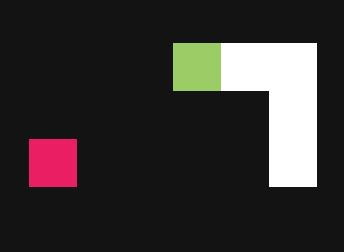

# Snake


Play: [http://pkief.github.io/Snake](http://pkief.github.io/Snake)

## Game description
Snake is a game in which you are moving a snake on a 2D field. If the snake eats food it gets bigger by one unit. By the time it gets bigger and bigger and so it is more difficult to move the snake inside the field. The game ends if the snake has not enough space to move and beats itself.

## How to play
### Desktop
#### Change direction
The snake game is really simple to play. On a desktop computer you have to press the arrow keys to change the direction of the snake. The snake is moving forward automatically.

#### Game pause
To stop the game you have to press Escape. Press Esc again to continue moving the snake.

#### Speed up
If you want to speed up the snake you have to hold the arrow key for the direction in which you want to move your snake faster.

### Mobile / touch device
#### Change direction
The way how you use snake on a touch device is very intuitive. To change the direction of the snake you have to swipe with one finger in the certain direction.

#### Game pause
Tap with one finger on the field to pause the game. Tap again to continue playing.

#### Speed up
To speed up the snake you have to press one finger on the screen. If you release your finger of the screen the snake is moving with its normal speed again.

### Tricks
#### Border
To be very efficient with the remaining space in the field you can also move the snake to the border of the field. If the snake reaches the border it will appear on the opposite side of the field. So you can quickly change the sides of the field, too.

## Local development
The game is implemented by JavaScript and uses the plugin jQuery. You can find the methods and the logic in the `src/main.js` file.

### Getting started
Install required node modules with this command:

```
npm install
```

Run the app with this command:

```
npm start
```

